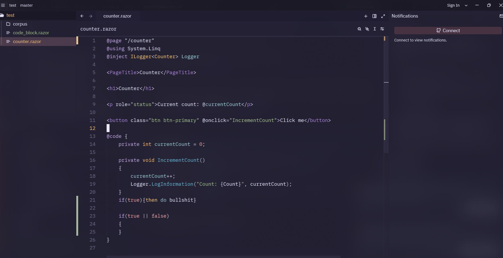

# Tree-sitter Razor

<strong><span style="color:red">Let me know if you want upgrades.</span></strong>

> **Note:** This project made with AI. It does work. Use with caution. I quickly build this project (in 1 hour) just for using ZED with Blazor-Razor pages. It lacks structure, coding standarts, and every other professional aspect. Just an AI slop


A [Tree-sitter](https://tree-sitter.github.io/tree-sitter/) grammar for ASP.NET Razor Pages (`.razor`, `.cshtml`).

This grammar provides robust parsing for the Razor syntax, including:
- Directives (`@page`, `@inject`, `@code`, etc.)
- Control structures (`@if`, `@foreach`, `@switch`, etc.)
- Explicit and implicit C# expressions (`@(...)`, `@someVar`)
- HTML integration with attributes
- C# code block injection



## Features

- **Accurate Parsing**: Handles mixed C# and HTML content typical in Razor files.
- **Syntax Highlighting**: Includes queries for syntax highlighting.
- **Injection Support**: seamless C# injection inside `@code` blocks and control structures.
- **Zed Editor Support**: Ready-to-use integration for the Zed editor.

## Development

### Prerequisites

- [Node.js](https://nodejs.org/) (v18+)
- C Compiler (MSVC on Windows, GCC/Clang on Linux/macOS)
- Tree-sitter CLI (`npm install -g tree-sitter-cli`)

### Setup

1.  Clone the repository:
    ```bash
    git clone https://github.com/yourusername/tree-sitter-razor.git
    cd tree-sitter-razor
    ```

2.  Install dependencies:
    ```bash
    npm install
    ```

3.  Build the grammar:
    ```bash
    npm run build
    # or
    tree-sitter generate
    ```

### Testing

Run the corpus tests to verify the grammar:

```bash
# Standard test run
tree-sitter test

# Windows specific helper (sets up VS environment)
.\run_test.bat
```

To parse a specific file and see the syntax tree:

```bash
tree-sitter parse test/counter.razor
```

## Zed Editor Integration

This repository includes a local extension setup for [Zed](https://zed.dev).

### Local Development Setup

1.  Navigate to the `zed-razor` directory.
2.  Ensure you have a compiled WASM grammar:
    ```bash
    tree-sitter build --wasm
    copy tree-sitter-razor.wasm zed-razor\grammars\razor.wasm
    ```
3.  Open Zed and install the extension as a "Dev Extension" pointing to the `zed-razor` folder.

### Extension Structure

- `zed-razor/extension.toml`: Extension manifest.
- `zed-razor/languages/razor/`: Language configuration and queries.
- `zed-razor/grammars/razor.wasm`: Compiled Tree-sitter grammar.

## Project Structure

- `grammar.js`: The Tree-sitter grammar definition.
- `src/`: Generated parser source code (C).
- `queries/`: Tree-sitter queries for highlighting and injections.
- `test/corpus/`: Test cases for the grammar.
- `zed-razor/`: Zed extension configuration files.

## License

MIT
